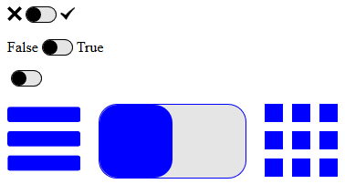
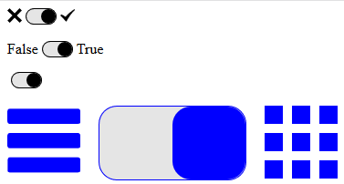

# Input Boolean
WebComponent for creating customisable boolean input elements.

## Preview:




## Attribute:
```true``` : If present value is set to true (i.e. the right value is choosen)

## Named slots:
The left option: ```false-opt```\
The right option: ```true-opt```

## Events:
Emits ```change``` event when the value is changed.

## Custom CSS
```--svg-color``` : SVG fill color (eg. #000)\
```--button-radius``` : Button border radius (eg. 1em)\
```--button-border``` : Button border value (eg. 1px solid)\
```--button-gap``` : Gap between left option, button and right option (eg. 0.5em)\
```--button-color``` : Color of the button (eg. #000)\
```--button-background``` : Background color of the button (eg. rgba(0, 0, 0, 0.1))

## Usage:
```HTML
<input-boolean></input-boolean>
```
Results in: 

```HTML
<input-boolean true></input-boolean>
```
Results in: 

```HTML
<input-boolean>
	<span slot="false-opt">False</span>
	<span slot="true-opt">True</span>
</input-boolean>
```
Results in: 