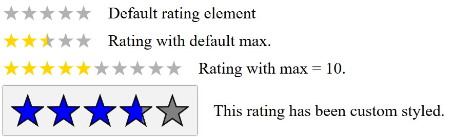

# Star Rating WebComponent
Defines a `<star-rating>` custom element.

### Sample preview

[See on JSFiddle](https://jsfiddle.net/bmx4n16k/)

## Attributes
- `value` : A *float* value repersenting the rating value. Default value is `0`.
- `max` : An *int* value repersenting the maximum rating value. Deafult value is `5`.
- `changeable` : When present the rating can be changed by clicking. Dispatches a `change` event with old and new values as `detail`.

## Properties
- `value` : Get and set the rating value. (`float`)
- `max` : Get and set the maximum possible rating value. (`int`)

## Custom CSS properties
- `--star-fill-color`
- `--star-back-color`
- `--star-stroke`
- `--star-stroke-width`
- `--star-stroke-opacity`

## Examples
```html
<star-rating></star-rating>

<star-rating value="2.5"></star-rating>

<star-rating value="5" max="10"></star-rating>

<star-rating value="2" max="5" changeable></star-rating>
```
Check *example.html* to view it in action.